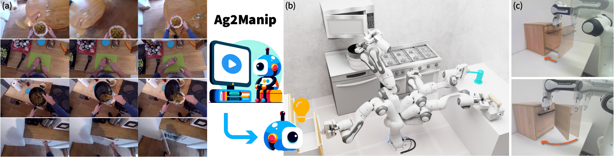

# Ag2Manip
Code Repository for **Ag2Manip: Learning Novel Manipulation Skills with Agent-Agnostic Visual and Action Representations**

by [Puhao Li](https://xiaoyao-li.github.io/)<sup> *</sup>, [Tengyu Liu](http://tengyu.ai/)<sup> *</sup>, [Yuyang Li](https://blog.aidenli.net/), [Muzhi Han](https://sites.google.com/view/muzhihan/home), [Haoran Geng](https://geng-haoran.github.io/), [Shu Wang](https://github.com/AssassinWS), [Yixin Zhu](https://yzhu.io/), [Song-Chun Zhu](https://zhusongchun.net/), [Siyuan Huang](https://siyuanhuang.com/)

<p align="center">
    <a href='.'>
      
    </a>
    <a href='.'>
      
    </a>
    <a href='.'>
      
    </a>
</p>


**Ag2Manip enables various manipulation tasks in scenarios where domain-specific demonstrations are unavailable.** With agent-agnostic visual and action representations, Ag2Manip: (a) learns from human manipulation videos; (b) acquires diverse manipulation skills autonomously in simulation; and (c) supports robust imitation learning of manipulation skills in the real world.

## Abstract
Enhancing the ability of robotic systems to autonomously acquire novel manipulation skills is vital for applications ranging from assembly lines to service robots. Existing methods (*e.g.*, VIP, R3M) rely on learning a generalized representation for manipulation tasks but overlook (i) the domain gap between distinct embodiments and (ii) the sparseness of successful task trajectories within the embodiment-specific action space, leading to misaligned and ambiguous task representations with inferior learning efficiency. Our work addresses the above challenges by introducing **Ag2Manip** (<ins>Ag</ins>ent-<ins>Ag</ins>nostic representations for <ins>Manip</ins>ulation) for learning novel manipulation skills. Our approach encompasses two principal innovations: (i) a novel agent-agnostic visual representation trained on human manipulation videos with embodiments masked to ensure generalizability, and (ii) an agent-agnostic action representation that abstracts the robot’s kinematic chain into an agent proxy with a universally applicable action space to focus on the core interaction between the end-effector and the object. Through our experiments, Ag2Manip demonstrates remarkable improvements across a diverse array of manipulation tasks without necessitating domain-specific demonstrations, substantiating **a significant 325% improvement** in average success rate across 24 tasks from FrankaKitchen, ManiSkill, and PartManip. Further ablation studies underscore the critical role of both representations in achieving such improvements.


## Citation
If you find this work is helpful, please consider citing us as
```

```

## Contact
If you have any questions about this work, feel free to contact Puhao Li at puhaoli01@gmail.com.